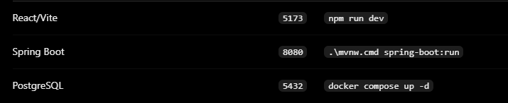

# Geovia
Geovia - platforma internetowa do nauki i weryfikacji wiedzy z geografii świata

Uruchomienie: 
1. Przejdź do katalogu aplikacji ...\Geovia>
2. Uruchom PostgreSQL: **docker compose up -d** (nie ważne w jakim IDE)
3. Przechodzimy do backednu: cd backend (np. w IntelliJ) oraz uruchamiamy go: **.\mvnw.cmd spring-boot:run**
4. Backend powinien wystartować na: **http://localhost:8080**
5. Przechodzimy do frontendu: cd frontend\geovia (np. w VSCode) a następnie: **npm install**, **npm run dev**
6. Projekt powinien wystartować na: **http://localhost:5173/**

